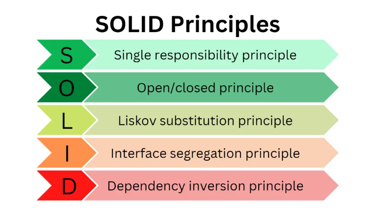

# SOLID PRINCIPLES

## What is Solid Principles?

- The SOLID Principles are five principles of Object-Oriented class design. They are a set of rules and best practices to follow while designing a class structure.
- These five principles help us understand the need for certain design patterns and software architecture in general.
- The five principles are Single responsibility principle, Open/closed principle, Liskov substitution principle, Interface segregation principle and Dependency inversion principle.

## Solid Principle Application in Python Flask

1. Single Responsibility Principle (SRP) - In Flask, we can create separate modules or classes for handling different responsibilities. For example, we can have a module for handling authentication, another for data retrieval or manipulation, and another for generating responses. Each module will have a clear and single responsibility, making it easier to understand and maintain.

# authentication.py

from flask import Flask

app = Flask(**name**)

@app.route('/login', methods=['POST'])
def login(): # Handle user authentication logic here
return 'Login successful'

# data.py

@app.route('/data', methods=['GET'])
def get_data(): # Retrieve data from the database here
return 'Data retrieved successfully'

# response.py

@app.route('/response', methods=['POST'])
def generate_response(): # Generate response logic here
return 'Response generated successfully'

2. Open/Closed Principle (OCP) - To adhere to the Open-Closed Principle, we can design our Flask API to be easily extensible without modifying existing code. We can use inheritance and interfaces to achieve this. For example, if we want to add a new authentication method, we can create a new class that inherits from a base authentication class or implements an authentication interface.

# authentication.py

class BaseAuthentication:
def authenticate(self):
raise NotImplementedError

class UsernamePasswordAuthentication(BaseAuthentication):
def authenticate(self): # Username and password authentication logic here
return 'Authenticated with username and password'

class TokenAuthentication(BaseAuthentication):
def authenticate(self): # Token-based authentication logic here
return 'Authenticated with token'

@app.route('/login', methods=['POST'])
def login():
auth_method = TokenAuthentication() # Can be dynamically changed based on requirements
result = auth_method.authenticate()
return result

3. Liskov Substitution Principle (LSP) - To follow the Liskov Substitution Principle, we ensure that derived classes can be used interchangeably with their base classes. In Flask, we can define base classes or interfaces and make sure that derived classes adhere to the same contract.

# database.py

class BaseDatabase:
def fetch_data(self):
raise NotImplementedError

class MySQLDatabase(BaseDatabase):
def fetch_data(self): # MySQL-specific data retrieval logic here
return 'Data fetched from MySQL database'

class PostgresDatabase(BaseDatabase):
def fetch_data(self): # Postgres-specific data retrieval logic here
return 'Data fetched from Postgres database'

@app.route('/data', methods=['GET'])
def get_data():
db = PostgresDatabase() # Can be dynamically changed based on requirements
result = db.fetch_data()
return result

4. Interface Segregation Principle (ISP) - In Flask, we can create specific routes and handlers for different clients or functionalities, following the Interface Segregation Principle. This allows us to provide specific endpoints tailored to the needs of different clients, avoiding unnecessary dependencies.

@app.route('/user', methods=['GET'])
def get_user(): # User-related functionality here
return 'User details'

@app.route('/product', methods=['GET'])
def get_product(): # Product-related functionality here
return 'Product details'

5. Dependency Inversion Principle - To apply the Dependency Inversion Principle, we can use dependency injection and inversion of control in Flask. We can define dependencies as parameters and inject them when needed, rather than relying on concrete implementations directly.

# data.py

class DataHandler:
def **init**(self, database: BaseDatabase):
self.database = database

    def fetch_data(self):
        return self.database.fetch_data()

@app.route('/data', methods=['GET'])
def get_data():
db = MySQLDatabase() # Can be injected or configured externally
handler = DataHandler(db)
result = handler.fetch_data()
return result

## Real world use cases of Solid Principle

1. Single Responsibility Principle (SRP) - Imagine a baker who is responsible for baking bread. The baker’s role is to focus on the task of baking bread, ensuring that the bread is of high quality, properly baked, and meets the bakery’s standards.

2. Open/Closed Principle (OCP) - Imagine you have a class called PaymentProcessor that processes payments for an online store. Initially, the PaymentProcessor class only supports processing payments using credit cards. However, you want to extend its functionality to also support processing payments using PayPal.

3. Liskov Substitution Principle (LSP) - One of the classic examples of this principle is a rectangle having four sides. A rectangle’s height can be any value and width can be any value. A square is a rectangle with equal width and height. So we can say that we can extend the properties of the rectangle class into square class.

4. Interface Segregation Principle (ISP) - Suppose if you enter a restaurant and you are pure vegetarian. The waiter in that restaurant gave you the menu card which includes vegetarian items, non-vegetarian items, drinks, and sweets.

5. Dependency Inversion Principle - In a software development team, developers depend on an abstract version control system (e.g., Git) to manage and track changes to the codebase. They don’t depend on specific details of how Git works internally.

## References

https://www.freecodecamp.org/news/solid-principles-explained-in-plain-english/

https://medium.com/@jngisiro/the-solid-principles-using-python-and-flask-96c3fa878265

https://www.geeksforgeeks.org/solid-principle-in-programming-understand-with-real-life-examples/
